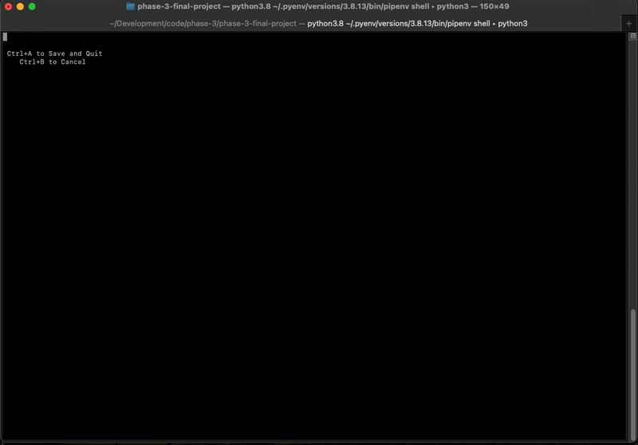

# Dance School Database CLI

This CLI application provides functionality to interact with a database for a dance school. It supports three roles: Admin, Teacher, and Student with specific permissions and actions for each role.

## Features

- **Admin Role:** View information on Teachers, Students, Classes, and Reports; Add, Update, and Delete Teachers, Students, and Classes
- **Teacher Role:** View and Update Teacher information; View, Update, Create, and Delete Reports
- **Student Role:** View Student information and Reports

## Tech Stack

Python 3.8.13, SqLite3, Npyscreen library for text editing

## Setup

Clone the project

```bash
  git clone https://github.com/mkennedyakgrown/phase-3-final-project
```

Go to the project directory

```bash
  cd my-project
```

Install dependencies

```bash
  pipenv install
```

Activate the virtual environment

```bash
  pipenv shell
```

Run the script cli.py

```bash
  python lib/cli.py
```

## Usage

This program operates through nested menus. As a user, you simply follow the on-screen instructions to navigate through the menus to your desired operation.

**Roles**

```
Choose your role:
    • Admin
    • Teacher
    • Student
    • Exit Program
```

**Admin:** As an Admin, you have the access to do the following:

- Get Info on Teachers, Studnts, Classes, and Reports
- Add or create new Teachers, Students, and Classes
- Update Teachers, Students, and Classes
- Delete Teachers, Students, Classes

```
Welcome, Admin! Select what to do:
    • Info (Teachers/Students/Classes/Reports)
    • Add (Teacher/Student/Class)
    • Update (Teacher/Student/Class)
    • Delete (Teacher/Student/Class)
    • Go Back
    • Exit Program
```

**Teacher:** As a Teacher, you have the access to do the following:

- View Teacher Info
- Update Teacher Info
- View Reports
- Write and Update Reports
- Delete Reports
- See what reports have yet to be written for each class and Student

```
Welcome, Teacher! Select what to do:
    • View Info
    • Update Info
    • View Reports
    • Write or Update Report
    • Delete Report
    • View Remaining Reports
    • Go Back
    • Exit Program
```

**Student:** As a Student, you have the access to do the following:

- View Student Info
- View Student Reports

```
Welcome, Student! Select what to do:
    • View Info
    • View Reports
    • Go Back
    • Exit Program
```

The only place the UI experience is especially different is the Teacher's Write and Update Reports text editor.



Entering the Write or Update Report function will prompt choices for first a Teacher, then a Class, and then a Student. After selecting the Student about whom the report will be written, you will be taken to a Text Editor window. Simply type your report in that window, including any line breaks, and use your keyboard's arrow keys to navigate through your text.

Type Ctrl+A to Save and Quit. This will save your new or updated report to the database, and then exit to the previous menu.

Type Ctrl+B to Cancel. This will disregard any changes that you've made to the report, and then exit to the previous menu. If creating a new report, it will save as an empty string.

## License

This project is licensed under the [MIT](https://choosealicense.com/licenses/mit/) License - see the LICENSE file for details.
